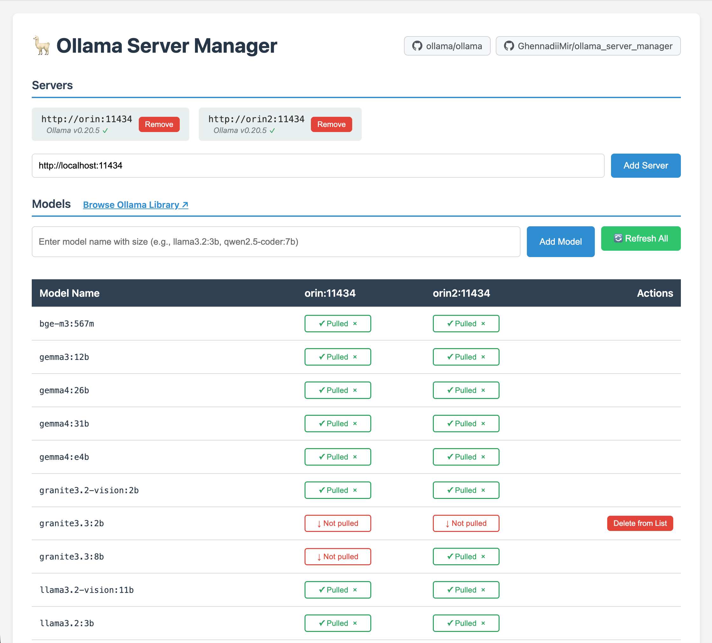

# 🦙 Ollama Server Manager

A streamlined web interface for managing Ollama models across multiple servers. Perfect for teams running distributed Ollama instances or managing models on different machines.



## ✨ Features

- **Multi-Server Management**: Connect and manage multiple Ollama servers from one interface
- **Unified Model View**: See all models across all servers in a single table
- **One-Click Operations**: Pull, remove, and manage models with simple button clicks; pulls run as background jobs on the server — safe to navigate away or refresh mid-pull
- **Real-Time Discovery**: Automatically discover installed models on your servers
- **Persistent Configuration**: Your server list is saved locally for convenience
- **CORS-Free**: Built-in proxy eliminates browser CORS restrictions
- **Host Network Aware**: Resolves any hostname the host machine can — Tailscale, VPN, mDNS, custom `/etc/hosts`

## 🚀 Quick Start

### 🐳 Docker Deployment (Recommended)

Run with Docker for easy deployment and automatic restarts. **Supports multiple platforms:**

- ✅ `x86_64` / `amd64` (Intel/AMD 64-bit) - Most common Docker platform
- ✅ `aarch64` / `arm64` (ARM 64-bit) - Raspberry Pi, AWS Graviton, Apple Silicon Linux
- ✅ `ruby` platform fallback for maximum compatibility

#### Linux

```bash
git clone https://github.com/GhennadiiMir/ollama_server_manager.git
cd ollama_server_manager
docker compose up -d
```

Uses `network_mode: host` — the container shares the host's full network stack, so any Ollama server reachable from the host (by hostname, IP, VPN, Tailscale, mDNS, etc.) works out of the box.

#### macOS / Windows (Docker Desktop)

```bash
git clone https://github.com/GhennadiiMir/ollama_server_manager.git
cd ollama_server_manager
docker compose -f docker-compose.macos.yml up -d
```

Uses standard port mapping. Server URL tips for Docker Desktop:

| Ollama location | URL to use |
|---|---|
| Same machine as the manager | `http://host.docker.internal:11434` |
| Another machine on your network | `http://192.168.1.100:11434` (use IP) |
| VPN / Tailscale remote host | Use the IP address of that host |

**Docker Management:**

```bash
# View logs
docker compose logs -f          # Linux
docker compose -f docker-compose.macos.yml logs -f   # macOS/Windows

# Stop the service
docker compose down

# Update to latest version from git
./redeploy.sh

# Manual rebuild and restart
docker compose up -d --build
```

**Quick Update Script:**

The `redeploy.sh` script automates updating your running container:

- Stops the current container
- Pulls the latest code from git
- Rebuilds and restarts with the new version

### Manual Installation (Alternative)

If you prefer to run without Docker:

**Prerequisites:**

- Ruby (2.7 or newer recommended)
- Bundler gem (`gem install bundler`)

**Setup:**

1. **Clone and install dependencies:**

   ```bash
   git clone https://github.com/GhennadiiMir/ollama_server_manager.git
   cd ollama_server_manager
   bundle install
   ```

2. **Start the server:**

   ```bash
   bundle exec puma
   ```

   Or specify a custom port:

   ```bash
   PORT=8080 bundle exec puma
   ```

3. **Open in your browser:**

   ```text
   http://localhost:9292
   ```

## 🎯 How to Use

1. **Add Your Servers**: Enter Ollama server URLs (e.g., `http://localhost:11434`, `http://server2:11434`)
2. **Discover Models**: Click "Refresh All" to scan all servers for installed models
3. **Manage Models**: Use the intuitive table interface to pull new models or remove existing ones
4. **Track Progress**: Monitor model operations with real-time status indicators

## 🏗️ Architecture

This tool consists of:

- **Ruby/Roda Backend**: Lightweight server that proxies requests to Ollama instances
- **Vanilla JavaScript Frontend**: No dependencies, works in any modern browser
- **Local Storage**: Persists your server configuration between sessions

The proxy design eliminates CORS issues and provides a seamless experience when managing remote Ollama servers.

The container runs with `network_mode: host`, sharing the host machine's full network stack. This means any server URL the host can reach — by hostname, IP, Tailscale name, VPN address, or mDNS — works without any extra configuration.

## 🔧 Troubleshooting

**Connection Issues:**

- Ensure your Ollama servers are running and accessible
- Verify server URLs and ports are correct
- Check firewall settings for remote servers
- If hostnames don't resolve, make sure they are resolvable on the **host machine** running the manager (not just in the browser) — the proxy inherits the host's DNS

**Hostnames resolve on the host but not inside the container (Linux):**

Some Ubuntu/Debian systems ship with `mdns4_minimal [NOTFOUND=return]` in `/etc/nsswitch.conf`. The `[NOTFOUND=return]` clause stops name resolution before it reaches DNS, breaking short hostnames (Tailscale names, VPN hostnames, custom `/etc/hosts` entries) inside the container even with `network_mode: host`. The `Dockerfile` fixes this automatically by switching to `files dns`, but if you are running the container on an older image you may need to rebuild:

```bash
docker compose up -d --build
```

**Models Not Appearing:**

- Click "Refresh All" to force a rescan
- Check browser console (F12) for error messages
- Confirm Ollama servers are responding to API requests

## 🤝 Contributing

Contributions are welcome! Feel free to submit issues, feature requests, or pull requests.

## 📄 License

This project is open source.
