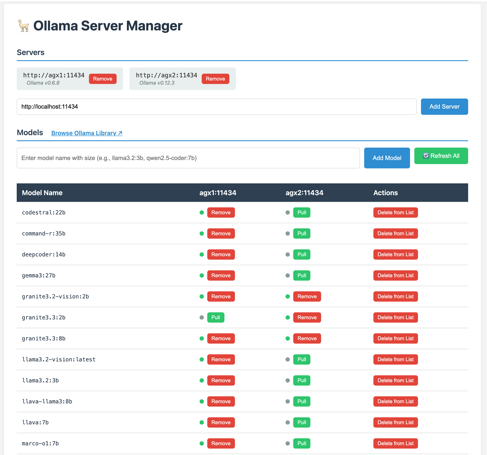

# 🦙 Ollama Server Manager

A streamlined web interface for managing Ollama models across multiple servers. Perfect for teams running distributed Ollama instances or managing models on different machines.



## ✨ Features

- **Multi-Server Management**: Connect and manage multiple Ollama servers from one interface
- **Unified Model View**: See all models across all servers in a single table
- **One-Click Operations**: Pull, remove, and manage models with simple button clicks
- **Real-Time Discovery**: Automatically discover installed models on your servers
- **Persistent Configuration**: Your server list is saved locally for convenience
- **CORS-Free**: Built-in proxy eliminates browser CORS restrictions

## 🚀 Quick Start

### Prerequisites

- Ruby (2.7 or newer recommended)
- Bundler gem (`gem install bundler`)

### Installation & Setup

1. **Clone and install dependencies:**

   ```bash
   git clone git@github.com:GhennadiiMir/ollama_server_manager.git
   cd ollama_server_manager
   bundle install
   ```

2. **Start the server:**

   ```bash
   bundle exec puma
   ```

   Or specify a custom port:

   ```bash
   PORT=8080 bundle exec puma
   ```

3. **Open in your browser:**

   ```text
   http://localhost:9292
   ```

### 🐳 Docker Deployment (Recommended)

Run with Docker for easy deployment and automatic restarts:

**One-liner command:**

```bash
docker compose up -d
```

**Alternative Docker run command:**

```bash
docker run -d --name ollama-server-manager -p 9292:9292 --restart unless-stopped $(docker build -q .)
```

**Features:**

- ✅ Automatic restart on server reboot (`restart: unless-stopped`)
- ✅ Health checks included
- ✅ Optimized for production use
- ✅ No Ruby installation required on host

**Docker Management:**

```bash
# View logs
docker compose logs -f

# Stop the service
docker compose down

# Rebuild and restart
docker compose up -d --build
```

## 🎯 How to Use

1. **Add Your Servers**: Enter Ollama server URLs (e.g., `http://localhost:11434`, `http://server2:11434`)
2. **Discover Models**: Click "Refresh All" to scan all servers for installed models
3. **Manage Models**: Use the intuitive table interface to pull new models or remove existing ones
4. **Track Progress**: Monitor model operations with real-time status indicators

## 🏗️ Architecture

This tool consists of:

- **Ruby/Roda Backend**: Lightweight server that proxies requests to Ollama instances
- **Vanilla JavaScript Frontend**: No dependencies, works in any modern browser
- **Local Storage**: Persists your server configuration between sessions

The proxy design eliminates CORS issues and provides a seamless experience when managing remote Ollama servers.

## 🔧 Troubleshooting

**Connection Issues:**

- Ensure your Ollama servers are running and accessible
- Verify server URLs and ports are correct
- Check firewall settings for remote servers

**Models Not Appearing:**

- Click "Refresh All" to force a rescan
- Check browser console (F12) for error messages
- Confirm Ollama servers are responding to API requests

## 🤝 Contributing

Contributions are welcome! Feel free to submit issues, feature requests, or pull requests.

## 📄 License

This project is open source.
